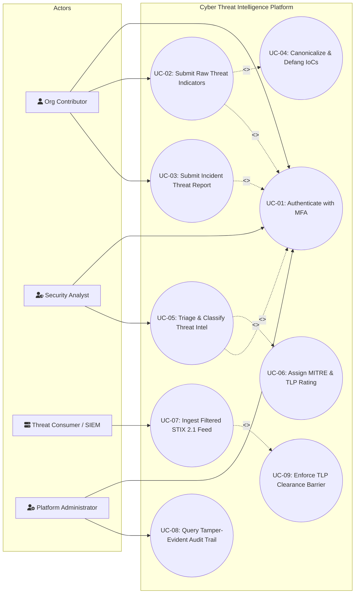
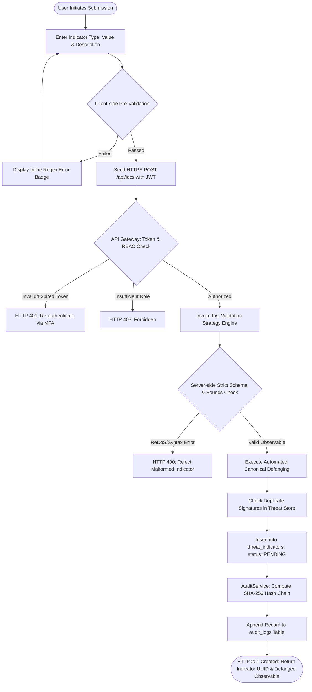

# PHASE 3 – REQUIREMENTS ANALYSIS AND UML [7 MARKS]
**Course:** 24CYS401 – Secure Software Engineering  
**System:** Topic 29 – Cyber Threat Intelligence (CTI) Sharing Platform  

---

## 1. UML Use Case Diagram

---

## 2. Critical Use Case Specifications

### Use Case Specification 1: Submit & Validate Threat Indicator (UC-02)

| Field | Detail |
| :--- | :--- |
| **Use Case ID** | `UC-02` |
| **Use Case Name** | Submit & Validate Threat Indicator |
| **Primary Actor** | Organization Contributor (`ROLE_CONTRIBUTOR`) |
| **Preconditions** | 1. Contributor has authenticated via MFA and holds a valid JWT access token. 2. Contributor's organization has a verified trust status. |
| **Main Success Scenario (Flow of Events)** | 1. Contributor submits indicator payload: Observable Type (e.g., `IPV4`, `DOMAIN`, `SHA256`), Raw Value, Description, and initial TLP tag. 2. System validates that the user holds `ROLE_CONTRIBUTOR` or `ROLE_ANALYST`. 3. System executes schema validation strategy matching the specific indicator type. 4. System computes defanged canonical representation (e.g., `1.1.1.1` $\rightarrow$ `1[.]1[.]1[.]1`, `evil.com` $\rightarrow$ `evil[.]com`). 5. System checks for duplicate active indicators in the database. 6. System stores indicator in `threat_indicators` table with `status = 'PENDING'`. 7. System logs `IOC_SUBMIT` event into the Tamper-Evident SHA-256 Audit Trail. 8. System returns HTTP 201 Created with indicator UUID and defanged value. |
| **Alternative Flows** | **3a. Format Validation Failure:** If observable value fails RFC/hex syntax (e.g. malformed IP octet > 255): System rejects with HTTP 400 Bad Request; logs validation error. **5a. Duplicate Indicator Detected:** System appends sighting occurrence counter and increments contributor correlation score without creating a duplicate record. |
| **Exception Flows** | **2a. Expired Token:** System returns HTTP 401 Unauthorized; contributor is prompted to re-authenticate. **4a. Malformed Payload Injection:** If body contains script tags or oversized payload (>100KB), API gateway rejects with HTTP 413 or 400. |
| **Postconditions** | Indicator is safely stored in pending triage queue; defanged value is previewable; tamper-evident audit record is appended. |

---

### Use Case Specification 2: Review & Classify Threat Intelligence with TLP (UC-05)

| Field | Detail |
| :--- | :--- |
| **Use Case ID** | `UC-05` |
| **Use Case Name** | Review & Classify Threat Intelligence with TLP |
| **Primary Actor** | Authorized Security Analyst (`ROLE_ANALYST`) |
| **Preconditions** | 1. Analyst is authenticated with active `ROLE_ANALYST` session. 2. One or more indicators exist in `PENDING` status. |
| **Main Success Scenario (Flow of Events)** | 1. Analyst queries the triage queue (`GET /api/iocs?status=PENDING`). 2. Analyst selects an indicator and reviews submitted provenance, defanged observable, and historical sightings. 3. Analyst verifies indicator validity, assesses false-positive risk, and assigns confidence score (0–100). 4. Analyst tags MITRE ATT&CK technique ID (e.g., `T1566.001` - Spearphishing Attachment). 5. Analyst assigns final Traffic Light Protocol rating (`CLEAR`, `GREEN`, `AMBER`, or `RED`). 6. Analyst records triage decision (`APPROVED` or `REJECTED`) with mandatory justification text. 7. System records immutable review decision in `review_logs` table. 8. System updates indicator status to `APPROVED`. 9. System records `IOC_TRIAGE_APPROVED` in the Tamper-Evident SHA-256 Audit Trail. 10. System returns HTTP 200 OK with updated indicator object. |
| **Alternative Flows** | **6a. Rejection:** Analyst selects `REJECTED` and inputs justification (e.g., "Legitimate DNS resolver - false positive"). Indicator status becomes `REJECTED` and is excluded from feeds. |
| **Exception Flows** | **1a. Unauthorized Role:** Contributor or Consumer attempts to triage indicator $\rightarrow$ System rejects with HTTP 403 Forbidden. **6a. Missing Justification:** Analyst submits decision without explanation $\rightarrow$ System rejects with HTTP 400 Bad Request. |
| **Postconditions** | Indicator is classified and published to feed according to TLP clearance; immutable review log and audit log are recorded. |

---

## 3. Scenario-Based Analysis Model
**Scenario:** *Submit and Validate Threat Indicators with Automated Defanging*

