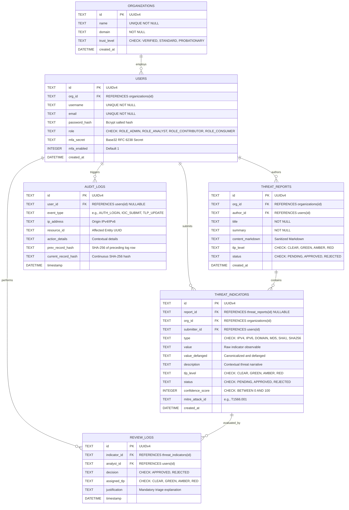
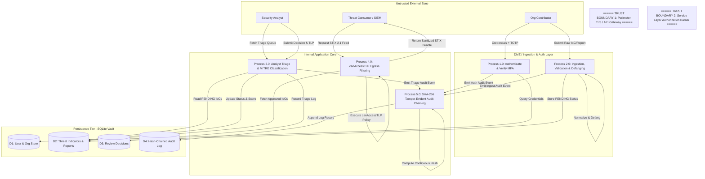

# PHASE 4 – DATA AND INFORMATION FLOW MODELING [7 MARKS]
**Course:** 24CYS401 – Secure Software Engineering  
**System:** Topic 29 – Cyber Threat Intelligence (CTI) Sharing Platform  

---

## 1. Entity-Relationship (ER) Model



---

## 2. Level-0 Context Data Flow Diagram (DFD)

```
                       ┌──────────────────────────────────────────────┐
                       │               UNTRUSTED ZONE                 │
                       │                                              │
[ Org Contributor ] ──►│ 1. Raw IoCs & Incident Reports (HTTPS)       │──┐
                       │                                              │  │
[ Security Analyst ] ◄─│ 2. Triage Queue & Alerts                     │  │
[ Security Analyst ] ──►│ 3. Classification & Approval Decisions       │  │
                       │                                              │  │
[ Threat Consumer ]  ◄─│ 4. Filtered STIX 2.1 Threat Feeds            │  │
                       └──────────────────────────────────────────────┘  │
                                              │                          │
                         ====================│==========================│===
                         TRUST BOUNDARY 1: PERIMETER / API GATEWAY       │
                         ================================================│===
                                              │                          │
                                              ▼                          ▼
                               ┌──────────────────────────────────────────────┐
                               │                 PROCESS 0.0                  │
                               │      CYBER THREAT INTELLIGENCE PLATFORM      │
                               └──────────────────────┬───────────────────────┘
                                                      │
                         =============================│======================
                         TRUST BOUNDARY 2: SECURE INTERNAL PERSISTENCE VAULT
                         =============================│======================
                                                      ▼
                                       ┌─────────────────────────────┐
                                       │   D1: Encrypted Database    │
                                       │   D2: Hash-Chained Audit    │
                                       └─────────────────────────────┘
```

---

## 3. Level-1 Detailed Data Flow Diagram with Trust Boundaries



### Trust Boundaries Defined:
1. **Trust Boundary 1 (Perimeter / API Gateway):** Separates untrusted public internet clients from internal endpoints. Enforces TLS 1.3 encryption, rate limiting (5 req/min on auth, 100 req/min on APIs), and Helmet security headers.
2. **Trust Boundary 2 (Service Layer / Information Barrier):** Separates unauthenticated/unvetted application components from sensitive operational intelligence. Enforces JWT signature verification, RBAC role validation, and the mandatory `canAccessTLP` egress filter.
